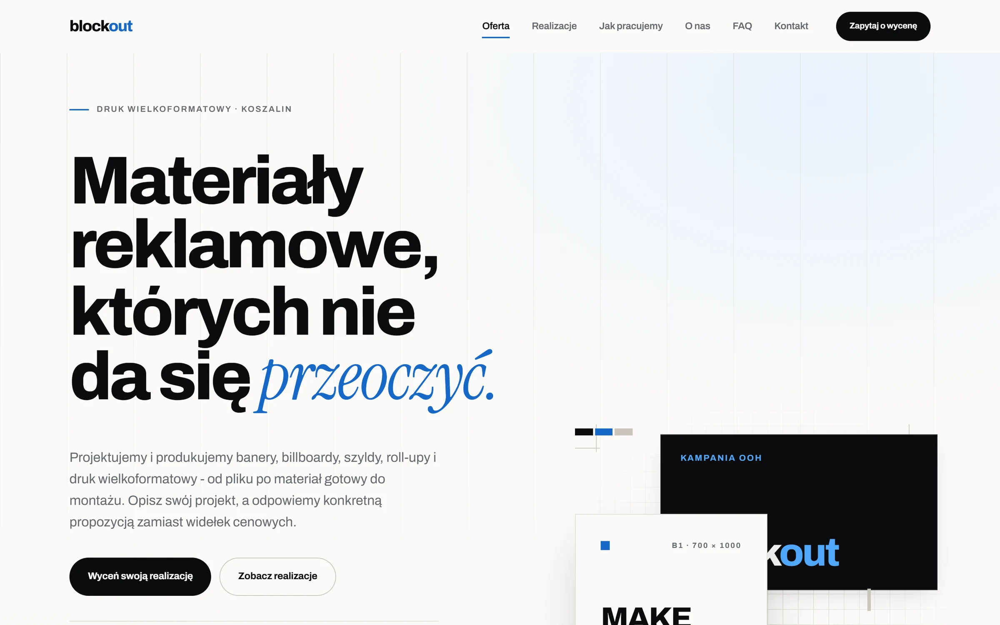
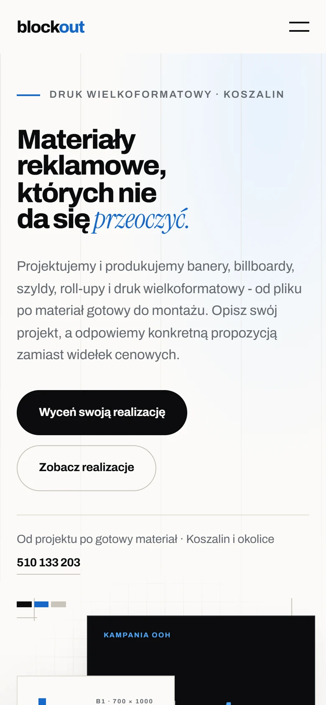

# Blockout – strona firmowa

Jednostronicowa strona dla Blockout, firmy z Koszalina od druku wielkoformatowego, banerów
i oznakowania firm. Jej zadaniem jest zbieranie zapytań o wycenę, więc każda sekcja kończy się
przyciskiem, a formularz kontaktowy jest dostępny z każdego miejsca strony.



## Stack

React 19, TypeScript i Vite, bez frameworka CSS. Style są w zwykłym CSS oparte na tokenach
(`src/styles/tokens.css`), a cała treść siedzi w plikach w `src/content`.

## Co jest w środku

- meta tagi, Open Graph i dane strukturalne (`LocalBusiness`, `FAQPage`) wstawiane do `index.html`
  przy buildzie, żeby widziały je też roboty, które nie uruchamiają JavaScriptu
- formularz z walidacją w Zod, ukrytym polem na boty i minimalnym czasem wypełnienia
- menu mobilne i galeria z obsługą klawiatury i pułapką focusu
- animacje tylko na `transform` i `opacity`, wyłączone przy `prefers-reduced-motion`
- Nginx w Dockerze z gzipem, cache'em plików i nagłówkami bezpieczeństwa



## Uruchomienie

```bash
npm install
npm run dev
```

Strona startuje na http://localhost:5173.

```bash
npm run lint
npm run build
npm run preview
```

## Formularz

Formularz wysyła zgłoszenia na adres z `VITE_CONTACT_ENDPOINT` (Formspree albo Web3Forms).
Bez tej zmiennej nie udaje wysyłki, tylko pokazuje telefon i e-mail.

```bash
cp .env.example .env
```

## Wdrożenie

Na hosting statyczny (Vercel, Netlify, Cloudflare Pages): komenda `npm run build`,
katalog `dist`, zmienna `VITE_CONTACT_ENDPOINT` w panelu hostingu.

Na własny serwer:

```bash
docker compose up -d --build
```

Strona jest wtedy pod portem 8080.
